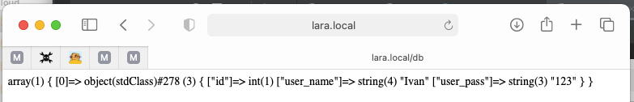

## Based on

## About

v 1.0.0
- add info for DB access in .env config
- add simple db-test-connection controller \App\Http\Controllers\DbController with index method
- add route for call controller's method oute::get('/db', [   \App\Http\Controllers\DbController::class,"index" ]
### result for <http://lara.local/db>:
- 
