##V 1.3 (MODELS and RELATION)
- add 'Task', 'Label', 'Status' models with different relations
- for example check relation 'on-to-many' between 'status' and 'task'

DbController consist of additional info about verifying of relation

result for call http://lara.local/db:
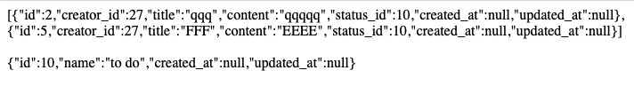

when data in 'tasks' table is:
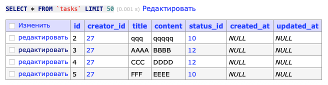

and data in 'statuses' table is:
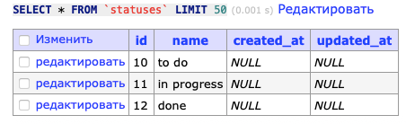

## SCHEME OF DB

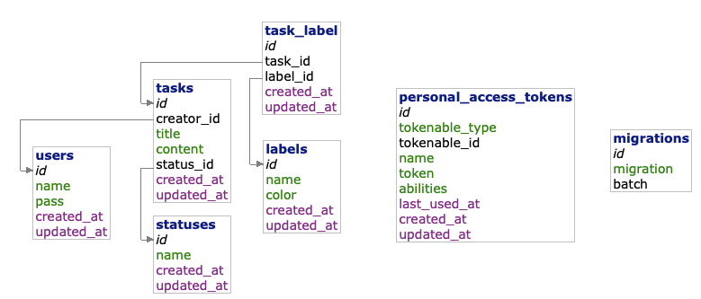

## V 1.2.0 (MIGRATIONS)
- add migrations for create of 4 tables 
- add separate migrations (add_creator_id, add_status_id, ) for create foreign keys
- create two seeders for data store

structure of tables:

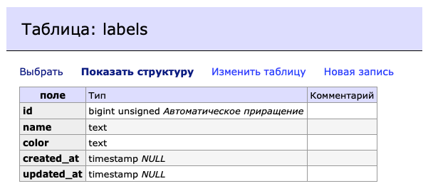

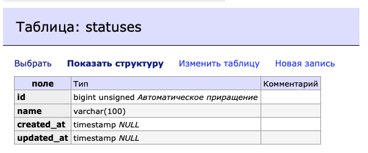

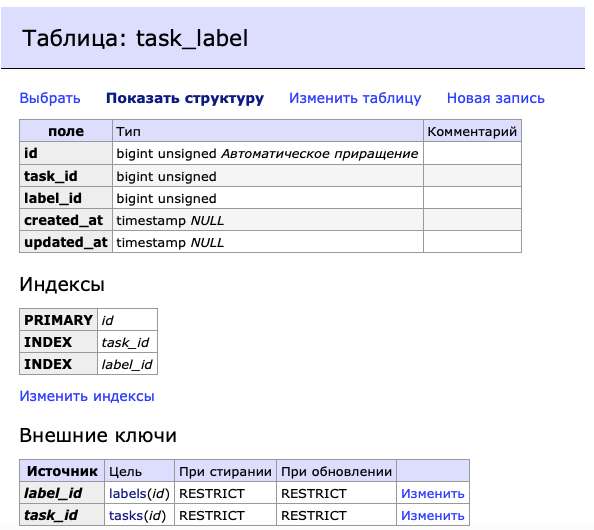

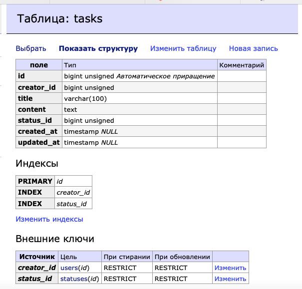

data in tables after seeding:

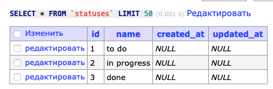

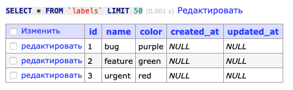

## V 1.1.0
- add HomeController with index method for show custom main page from "views";
- generate TaskController by artisan (only index method have realization yet)
- create UserCrudController with simple CRUD methods
- add "/" route for main page;
- add "/tasks" route for TaskController;
- add some named routes for methods of UserCrudController ("/reg","/show", "/del", "/auth") which grouped by name
  (i add group by controller for code simplification)

#### result for <http://lara.local>:
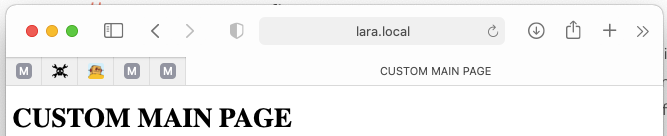

#### result for <http://lara.local/show>:
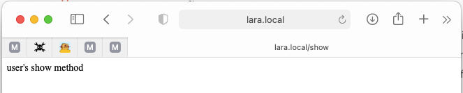

#### result for <http://lara.local/tasks>:
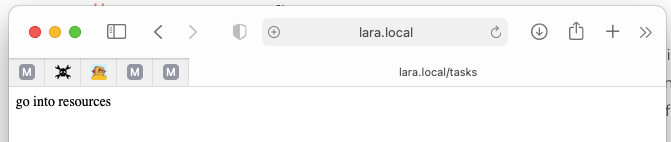

## V 1.0.0
- add info for DB access in .env config
- add simple db-test-connection controller \App\Http\Controllers\DbController with index method
- add route for call controller's method route::get('/db', [   \App\Http\Controllers\DbController::class,"index" ]
#### result for <http://lara.local/db>:

#### screen of original .env config - FOR TEACHER USE ONLY - NOT FOR PUBLIC!!! 
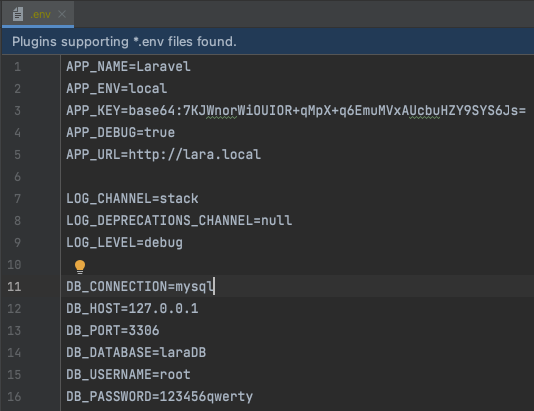

## Based on

